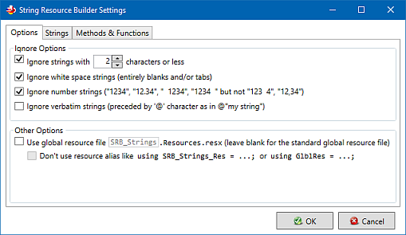
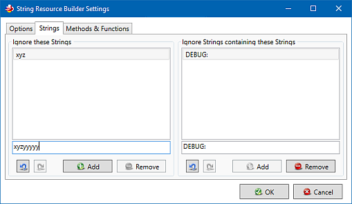
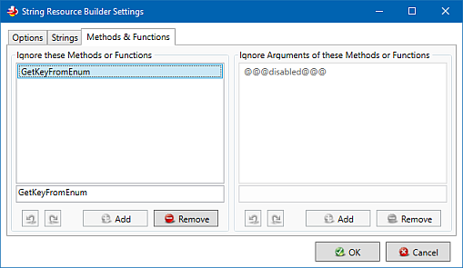

# Settings
There are some settings for reducing the amount of string literals to be found:
# "**Ignore strings with # characters or less**": string literals with the given amount of characters (or less) will not be listed.
# "**Ignore white space strings**": string literals containing nothing but white space or tabulator characters (in this case "\t" is **not** considered a white space because in code it consists of two characters) will not be listed.
# "**Ignore number strings**": string literals containing nothing but leading/trailing white space characters and numbers (also decimal numbers) will not be listed.
# "**Ignore verbatim strings**": verbatim string literals (preceded by @ character, C#) will not be listed.
# "**Use global resource file {{SRB_Strings.Resources.resx}}**": all string resources will be stored into the resource file with the given name (no name for the standard global resource file) placed into the {{Properties}} ({{My Project}} for VB) directory of the project or if not available in the project root.
# "**Ignore these Strings**": string literals found in this list (**exact match**) will not be listed.
# "**Ignore Strings containing these strings**": string literals containing one of the the given sub-strings will not be listed.
# "**Ignore these Methods or Functions**": string literals within the given methods or functions (at the moment the names are class-independent, may be subject to change by preceding the class name) will not be listed.
# **_ToDo_**: "**Ignore Arguments of these Methods or Functions**": string literals within the calling arguments of the given methods or functions will not be listed. **_ToDo_**
These settings might influence the performance of the code parsing, especially when using a lot of 'Ignore strings'.
## Screen shots

**Settings window "Options" tab**

**Settings window "Strings" tab**

**Settings window "Methods & Functions" tab**

