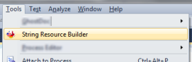
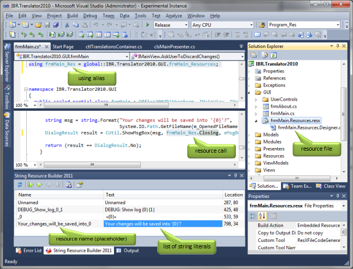

[Home][home] / [Documentation](Documentation.md) / Usage

# Usage

The tool is started via the Tools menu:

The presentation of the tool window within the IDE:

For a description of the buttons (reload, navigate, make, settings) in the tool window please refer
to their tool tips.  There is a [settings](Settings.md) window available (rightmost button) for some
filtering.

The main area of the tool window holds the found string literals of the currently active source
window (C# and VB.NET only).
* The first column holds the resource name to-be, which can be edited before _making_ the resource.
* The second column displays the string literal itself.
* The third column holds the location (line and column) of the string literal within the code window.

Double-clicking into one of the two rightmost columns will jump to and mark the string literal in
the source code.  This is also true for the navigation buttons (arrows) of the tool bar.

**Changed since build 11:**
Editing the source code while the tool window is open will result to a refresh, meaning that the
source code will be re-parsed for string literals.  This happens immeadiately after a key stroke
within the code window.  This might lead to some performance problems while typing.

**Hint:**
It is recommended to close the tool window while coding because of possible performance hits.

[See also: Settings](Settings.md)

[Back: About](About.md) / [Next: Revision History](RevisionHistory.md)

[home]: https://github.com/Dany-R/IBR.StringResourceBuilder2011
